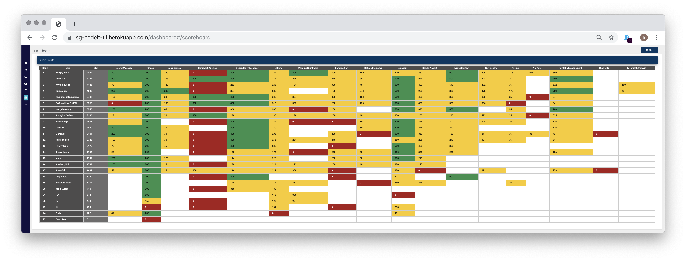

## Competition outcome

We won 3rd place in Singapore, with a score of 4405.



This is the trendline of the scores of the top four winning teams. The following graphics are obtained from the competition analytics dashboard.



This is the number of submissions that we have made for each question.



This is probably the submissions that make progress on the leaderboard.




## Set up guide

Clone this repo
```
git clone https://github.com/tonghuikang/codeITSussie2019
```

Create a Heroku account and an app with some name `<yourappname>`.

Install Heroku CLI on your computer. There are different instructions for different OSes.


Log in to heroku on your terminal
```
heroku login
```

Generate SSH keys
```
ssh-keygen -t rsa
heroku keys:add ~/.ssh/id_rsa.pub
```

Set up your remote server.
```
git remote -v
git remote add heroku git@heroku.com:<yourappname>.git
```

Read logs almost live.
```
heroku logs --app=huikang-cs --tail
```

For ease of deployment (there is no need for git discipline here.)
```
echo "alias ghjk = 'git add . && git commit -m 'auto' && git push heroku master" >> ./bashrc
```

To deploy solution (please SAVE your files first).

```
ghjk
```

## Additional notes

Each team member should use their own server. It is more efficient that no code is being pushed to another member during the competition, because resolving pull conflicts is a headache.

Each team member should also use different email accounts. The free tier only allows one build at a time.

We exclusive used Python for this competition, and it seems to be sufficient.


## Tips

Use Postman (app) to check if your API is working.

If you want to catch API requests, you can set up one at requestbin.com.


## Original Guide
Following is the original guide when the sample code was downloaded.


These instruction are to help you solve a test challenge "Calculate Square". Instruction to this test challenge can be found at https://calculate-square.herokuapp.com/instructions

Step by step

As per the instruction you have to implement a post endpoint /square

- Go to `square.py` under `codeitsuisse/routes` folder in this template and you will find a post method with name  `/square` 
- write your implementation in this method. This method will be the entry point when you submit your solution for evaluation
- Note the __init__.py file in each folder. This file makes python treat directories containing it to be loaded in a module
- Follow similar approach to implement actual challenges during the event
